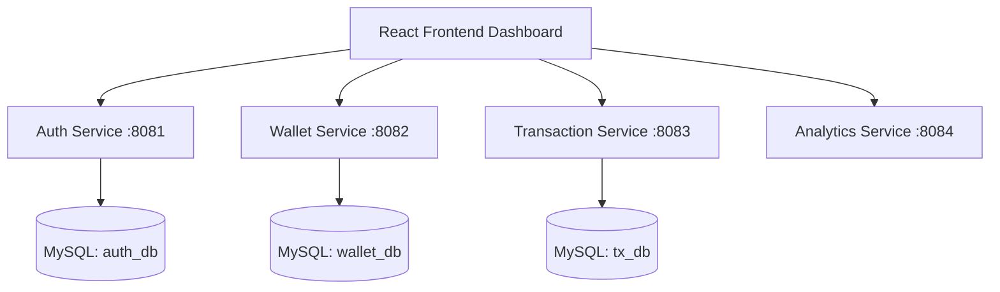

# 🚀 Smart Digital Wallet & Expense Management

A robust, full-stack microservices application built for high performance, scalability, and security. It enables users to manage digital wallet balances, track expenses, categorize transactions, and gain real-time analytics.

---

## 🏆 Hackathon Highlights
- **Microservices Architecture:** Independently scalable Spring Boot services.
- **Robust Security:** JWT-based stateless authentication, BCrypt password hashing, and Spring Security.
- **Fail-Safe Transactions:** Atomic DB operations ensuring wallet consistencies.
- **Analytics Dashboard:** Real-time visual insights built using React.js and standard Custom CSS.

---

## 🏗️ Architecture & Microservices Design

We employed a microservices strategy handling bounded contexts:

1. **Auth Service:** User registration, login, and token issuance.
2. **Wallet Service:** Maintains the source-of-truth for user balances.
3. **Transaction Service:** Records incoming and outgoing funds with specific categorizations.
4. **Analytics Service:** Aggregates transaction data for dashboard visualizations.

### Architecture Flow


---

## 🛠️ Technology Stack
- **Backend:** Java 17, Spring Boot 3.x, JPA/Hibernate.
- **Frontend:** React.js, Standard Custom CSS, Axios, Recharts.
- **Database:** MySQL (Multi-schema for microservices).
- **Security:** Spring Security, JWT (JSON Web Tokens).

---

## 📂 Project Structure

```text
smart-wallet/
├── backend/
│   ├── auth-service/        # Port 8081 - Security & Users
│   ├── wallet-service/      # Port 8082 - Balance management
│   ├── transaction-service/ # Port 8083 - Expense logging
│   └── analytics-service/   # Port 8084 - Aggregations
└── frontend/
    └── smart-wallet-ui/     # React SPA
```

---

## 🚀 How to Run Locally

### Prerequisites
- JDK 17+
- Node.js 18+
- MySQL Server installed locally
- Maven

### 1. Configure Databases
Ensure you have a local MySQL server running. The microservices will automatically create their required schemas (`auth_db`, `wallet_db`, `tx_db`) if not present.

### 2. Run Backend Services
Launch the microservices via your IDE, or run maven locally:
```bash
mvn spring-boot:run
```
*(Run this command in each microservice folder: auth-service, wallet-service, etc.)*

### 3. Run Frontend
```bash
cd frontend/smart-wallet-ui
npm install
npm start
```
*The app will be available at `http://localhost:3000`.*
