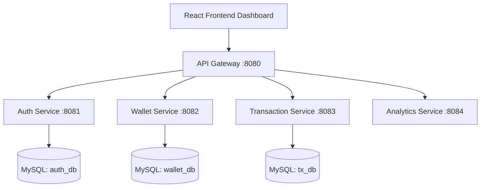

# 🚀 Smart Digital Wallet & Expense Management

A production-ready, full-stack microservices application built for high performance, scalability, and security. It enables users to manage digital wallet balances, track expenses, categorize transactions, and gain real-time analytics.

---

## 🏆 Hackathon Highlights
- **Microservices Architecture:** Independently scalable Spring Boot services communicating cleanly behind an API Gateway.
- **Robust Security:** JWT-based stateless authentication, BCrypt password hashing, and Spring Security.
- **Fail-Safe Transactions:** Atomic DB operations ensuring wallet consistencies.
- **Analytics Dashboard:** Real-time visual insights built using React.js and cached data.

---

## 🏗️ Architecture & Microservices Design

We employed a microservices strategy handling bounded contexts:

1. **API Gateway:** Centralized routing and JWT validation entry point.
2. **Auth Service:** User registration, login, and token issuance.
3. **Wallet Service:** Maintains the source-of-truth for user balances.
4. **Transaction Service:** Records incoming and outgoing funds with specific categorizations.
5. **Analytics Service:** Aggregates transaction data for dashboard visualizations.

### Architecture Flow


---

## 🛠️ Technology Stack
- **Backend:** Java 17, Spring Boot 3.x, Spring Cloud Gateway, JPA/Hibernate.
- **Frontend:** React.js, TailwindCSS, Axios, Recharts.
- **Database:** MySQL (Multi-schema for microservices).
- **Security:** Spring Security, JWT (JSON Web Tokens).
- **Deployment:** Docker, Docker Compose.

---

## ⚡ Core Features
- **Secure Authentication:** Registration and login flows guarded by JWT.
- **Wallet Operations:** Add funds or deduct balances seamlessly.
- **Expense Tracking:** Log income/expenses under categories like `Food`, `Travel`, or `Bills`.
- **Global Exception Handling:** `@ControllerAdvice` managing custom errors (e.g., `InsufficientBalanceException`).
- **Data Visualizations:** Clean React dashboard showing historical charts.

---

## 📂 Project Structure

```text
smart-wallet/
├── backend/
│   ├── api-gateway/         # Port 8080 - Routes traffic
│   ├── auth-service/        # Port 8081 - Security & Users
│   ├── wallet-service/      # Port 8082 - Balance management
│   ├── transaction-service/ # Port 8083 - Expense logging
│   └── analytics-service/   # Port 8084 - Aggregations
└── frontend/
    └── smart-wallet-ui/     # React SPA
```

---

## 🚀 How to Run Locally

### Prerequisites
- JDK 17+
- Node.js 18+
- Docker & Docker Compose (for DBs)
- Maven

### 1. Start Support Services (Databases)
```bash
cd backend
docker-compose up -d
```
*This will spin up the necessary MySQL and Redis containers.*

### 2. Run Backend Services
Launch the microservices via your IDE, or run maven locally:
```bash
mvn spring-boot:run
```
*(Ensure Eureka Server / API Gateway starts first if using service discovery).*

### 3. Run Frontend
```bash
cd frontend/smart-wallet-ui
npm install
npm start
```
*The app will be available at `http://localhost:3000`.*
