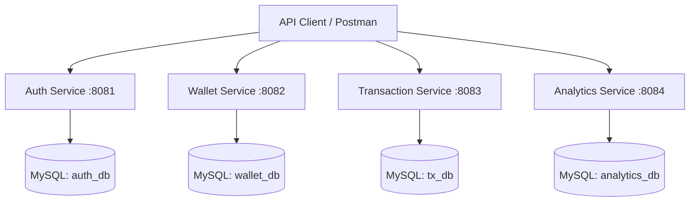

# Smart Digital Wallet & Expense Management

A robust microservices backend application built for high performance, scalability, and security. It exposes REST APIs designed to manage digital wallet balances, track expenses, categorize transactions, and gain real-time analytics.

---

## 🏗️ System Architecture & Flow

The backend is built using a strict 3-layer microservice architecture (Controller → Service → Repository), ensuring bounded contexts and independent scalability.

1. **Auth Service (Port 8081):** Manages user registration, login, and token issuance.
2. **Wallet Service (Port 8082):** Maintains the source-of-truth for user balances with atomic DB operations.
3. **Transaction Service (Port 8083):** Records incoming and outgoing funds with specific categorizations, securely communicating with the Wallet Service.
4. **Analytics Service (Port 8084):** Aggregates transaction data and caches analytics snapshots into its own database.



---

## 🛠️ Technology Stack

- **Framework:** Java 17, Spring Boot 3.x, Spring Data JPA/Hibernate, Lombok.
- **Database:** MySQL (Multi-schema for isolated microservices).
- **Security:** Spring Security, BCrypt, JWT.

---

## 📂 Project Structure

```text
smart-wallet/
└── backend/
    ├── auth-service/        # Security & User Management
    ├── wallet-service/      # Atomic Balance Management
    ├── transaction-service/ # Expense Logging & Incomes
    └── analytics-service/   # Data Aggregation & Snapshots
```

---

## 🚀 Running the Application

1. **Database Setup**
   Ensure you have a local MySQL server running on port `3306` with root access (username: `root`, password: `root`). 
   The microservices will automatically create their respective schemas (`auth_db`, `wallet_db`, `tx_db`, `analytics_db`) upon startup.

2. **Booting the Microservices**
   Launch each microservice sequentially via your IDE, or run Maven locally inside each service's directory (auth-service, wallet-service, etc):
   ```bash
   mvn spring-boot:run
   ```
